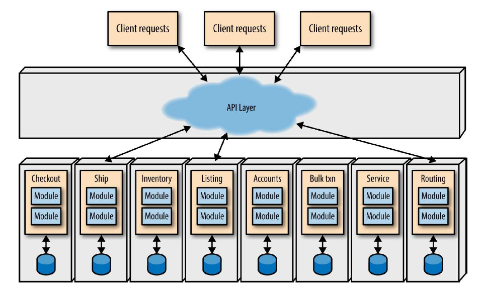
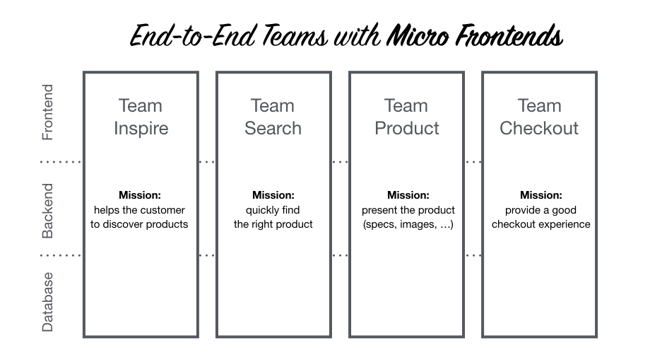

# Microservices

See:

- Building Evolutionary Architectures (book by Neal Ford, Rebecca Parsons and Patrick Kua) ([summary slides](https://www.slideshare.net/thekua/building-evolutionary-architectures))
- Clean Architecture (book by Robert C. Martin)
- [Learning the hard way: Microservices](https://itnext.io/microservices-c8b5dbdd58b8)
- [BoundedContext](https://www.martinfowler.com/bliki/BoundedContext.html)
- [Pattern: Database per service](https://microservices.io/patterns/data/database-per-service.html)
- [How to keep relationship integrity with Microservice Architecture](https://softwareengineering.stackexchange.com/questions/381279/how-to-keep-relationship-integrity-with-microservice-architecture)

## Basic idea

- The system is divided into several small services that each encapsulate a certain functional area across several layers of the technical stack, even down to the database
  - "Shared nothing", decrease coupling between services as much as possible
  - Sharing of a database between services is generally considered bad practice, because it prevents services from independently making changes to their database structure (or independently choosing the database technology which makes the most sense for the service)
  - Freedom to choose or change the technology used by a service based on what makes most sense. Some service may use a relational database while another one uses a document store. A service providing information about the relationships between different users could switch to a graph database without any other service being affected by the change.
- Different small teams each take ownership of one or more of these services
  - Team responsible for a microservice takes control of development and deployment
    - Each service is expected to handle reasonable error scenarios and recover if possibe
  - Changes within a single functional domain (= single service) can happen within a single team
  - Coordination with other teams is only required if the communication with their services needs changes as well
  - Challenge: making sure integration points between services don't break (things like contract testing can help)
- Services integrate with each other by passing messages, most often over HTTP or message queues
- Typically combined with Continuous Delivery, automatic machine provisioning and deployment, ...
- Monitoring and logging typically first-class architectural concepts
  - Several services, each of which might be scaled across several instances -> large number of processes to watch
  - This means having a good monitoring and logging setup is essential in keeping the system running smoothly
- Can help with scaling the development organization into several teams that can (to a large extent) work independently of each other
- Services can be developed, deployed and scaled independently
- Can be overkill (and introduce more problems than it solves) for a single small team
- Challenging to find the best way to divide the system into services. Defining this upfront is risky. Typically, it's best to start with a monolith or very small number of services and extract certain parts into separate services when it makes sense.

## Coupling in a microservices architecture

The goal of a microservices architecture is typically to minimize inappropriate coupling. However, some coupling is still needed to create a useful system.

### Integration coupling

This type of coupling is the most obvious one: The fact that services communicate with each other means that services will still depend on each other to some extent. If your service needs customer data, there are scenarios where a change to the Customer service could impact you. As always, these dependencies should be carefully managed.

### Service template coupling

*Service template*: shared template that all services can build upon

- Contains general stuff like monitoring, logging, and authentication/authorization.

- Teams maintaining the services build their services upon this template
- Much easier to ensure compliance and manage upgrades to monitoring system etc. than if each service team would build their own version of this
  - When the infrastructure team pushes an upgrade to the service template, the services pick it up the next time they go through the deployment pipeline
- This likely means all services will be built using the same language or limited set of languages. Although this takes away some of the freedom regarding technology, it also means that developers can more easily move between teams if necessary and that it's easier to create shared libraries or share knowledge between teams.

Example general service templates: [DropWizard](https://www.dropwizard.io) and [Spring Boot](https://spring.io/projects/spring-boot)

## Data duplication and bounded contexts

What if different services are interested in the same concept? Remember, sharing databases between services is considered bad practice!

Typical approach: each service stores its own representation of the concept

This can be seen as duplication, but:

- If a service stores the data it needs, it is less dependent on other services (both regarding availability and code coupling)
- Data that different services store for that same thing will depend on what the specific services need
- Same domain concept may have completely different representations in different services
- Data (or shape of data) regarding the same concept in different services will likely change at different times and for different reasons

This approach corresponds to the DDD concept of [Bounded Contexts](https://www.martinfowler.com/bliki/BoundedContext.html)

Example: e-commerce system using a microservices architecture

- Situation:
  - Customer service which manages a whole lot of data about each customer, including their shipping address
  - Order service, which maintains orders and needs the shipping address of the customer
- Approach 1: let Order service store a customer ID with each Order
  - Whenever all information for an order needs to be retrieved, customer’s address is retrieved from the Customer service
  - Problem: if the Customer service is unavailable or the customer has been deleted, the Order service has no idea which address to use for the order
  - Problem: if the customer’s address changes, the current shipping address for a customer may not be the address that a certain order was shipped to
- Approach 2: let Order service store customer ID and customer’s shipping address
  - Essentially, Order service stores a snapshot of the data it needs
  - If the order is retrieved from the Order service later on, the service will use the shipping address that it has stored

Some services may even be entirely focused on aggregating bits of data from other services!

- Can be useful for search, analysis, ...

- Example: functionality to view some general info about the most recent orders of customers, allowing to filter customers by some key attributes
  - Can make sense to put this in separate Insights service
  - Service gathers data from the Customer and Order services (could be push, through API calls or message queue, or pull)
  - Service stores data in a format that includes exactly the required information
  - When the service receives a request, it can gather the required data directly from its own database

## Micro frontends

See:

- [Micro Frontends](https://micro-frontends.org/)
- [Micro frontends—a microservice approach to front-end web development](https://medium.com/@tomsoderlund/micro-frontends-a-microservice-approach-to-front-end-web-development-f325ebdadc16)
- [MicroFrontends](https://martinfowler.com/articles/micro-frontends.html)
- [[Tailor made Micro Frontends](https://craftsmen.nl/tailor-made-micro-frontends/)](https://craftsmen.nl/tailor-made-micro-frontends/)

Even with microservices in the backend, the frontend is often monolithic:

- Often a single, large and feature-rich single-page app cutting across all of the functional areas represented by the backend microservices
- Problems:
  - Frontend can become so big that it’s difficult to maintain
  - Frontend often also developed by a separate team, meaning that that team needs to coordinate with the backend teams when building functionality.

Alternative approach: Micro frontends

- Frontend is split into different parts in the same way that the backend is
- Teams are responsible for their functional part of the application across the entire stack, from the database up to the frontend.
- The actual frontend that the user interacts with is stitched together from the functional parts developed by different teams
  - Some patterns/frameworks available that can help

Implementation approaches:

- **Server-side template composition:** HTML is rendered on the server side, the main template contains includes that insert the HTML of the relevant micro frontends
- **Build-time integration:** The micro frontends are published as packages, which are then imported into the main "container" application as dependencies
  - Disadvantage: coupling at build and release time
- **Run-time integration via iframes:** Use iframes to stitch together the different parts
  - Disadvantage: routing, history, and deep-linking are more complicated
  - Disadvantage: harder to create good responsive designs
- **Run-time integration via JavaScript:** Each micro frontend will be a bundle.js file that can be released independently and is retrieved and mounted asynchronously as needed, using JavaScript
  - Example implementation: [Tailor](https://github.com/zalando/tailor)
- **Run-time integration via WebComponents:** Each micro frontend will define a custom HTML element (WebComponent) that the container application can instantiate