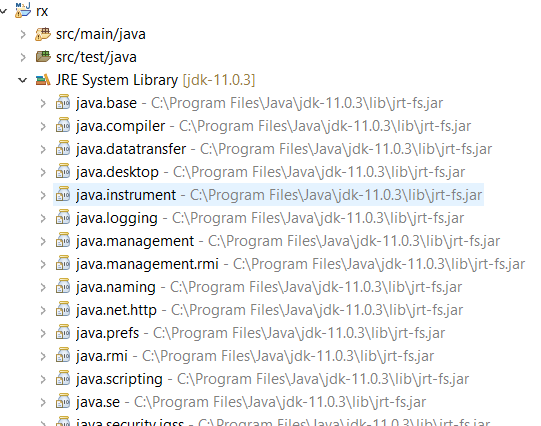
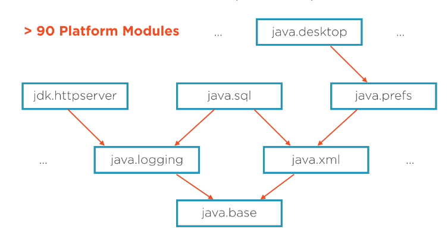

# Java Platform Module System

See:

- Core Java SE 9 for the Impatient (book by Cay S. Horstmann)
- [The Java Platform Module System](https://dzone.com/articles/the-java-platform-module-system)
- [Java Platform Module System Cheat Sheet](https://jrebel.com/wp-content/uploads/java-9-modules-cheat-sheet.pdf)
- [What's the difference between requires and requires transitive statements in Java 9?](https://stackoverflow.com/questions/46502453/whats-the-difference-between-requires-and-requires-transitive-statements-in-jav)
- Java 9, OSGi and the Future of Modularity [part 1](https://www.infoq.com/articles/java9-osgi-future-modularity/) [part 2](https://www.infoq.com/articles/java9-osgi-future-modularity-part-2/)

## Basic idea

- Introduced in Java 9
- Also known as "Project Jigsaw"
- A module encapsulates packages and the classes it contains, choosing what to expose to the outside world
- Designed to structure the code in the JDK
  - Hiding access to internal classes
    - Some internal classes are public, because they are used outside of their package, but still shouldn't just be available to everybody
  - Reducing footprint: 
    - JDK is split into several modules, each their own JAR, and you only need to load the modules your application actually uses
    - Huge benefit for IoT applications running on limited hardware
  - Maintainability:
    - Modules are explicit about how they depend on each other, making them easier to reason about than just a huge number of packages
    - Deprecation: 
      - Functionality can now be deprecated at the module level
      - Explicit dependencies between modules make impact of deprecation more clear
- Supported by the Java compiler and virtual machine, does not rely on class loaders like other module systems (such as OGSi)

## Levels of encapsulation

Lowest level of encapsulation: classes

- Private members only accessible within class itself
- Package private (default access level) members: also accessible from same package
- Protected members: also accessible to subclasses
- Public members: accessible from everywhere


([image source](https://www.programcreek.com/2011/11/java-access-level-public-protected-private/))

Higher level of encapsulation: packages

- Package can make some classes public to expose them and keep the rest package private
- Limitation: Java has no concept of nested packages!
  - If you have package top and package top.nested, code in top cannot access package private code in top.nested or vice versa

Modules provide an even higher level of encapsulation!

## Defining a module

Module declaration sits in module-info.java file in base directory. This file is compiled into a JAR in order to make the JAR a modular JAR.

Example module-info.java file:

```java
module java.sql {
    exports java.sql;
    exports javax.sql;
    exports javax.transaction.xa;
    
    requires java.logging;
    requires java.xml;
}
```

Possible contents of module declaration:

- module *module.name*: define the name of the module (by convention, the same as the main package name)
  - Note: module names are only used in module declarations! In normal code, you still just import packages and classes
- exports *package.name*: this module exports public members in package *package.name*
  - Note: you cannot have two packages with the same name in different modules, even if they are not exported
- exports *package.name* to *module.name*: this module exports public members in package *package.name*, but only to module *module.name*
- opens *package.name*: this module allows reflective access to members of package *package.name*, including private members
  - Reflective access is used by things like ORMs, XML or JSON object mappers, ...
  - You can also declare an entire module as open to make it open all of its packages
- opens *package.name* to *module.name*: this module allows reflective access to members of package *package.name*, including private members
- requires *module.name*: this module depends on *module.name*
- requires transitive *module.name*: this module depends on *module.name* and any module requiring this module implicitly also requires *module.name*
  - This is not the case for a normal require! In that case, a module requiring this module would also need to explicitly require *module.name* in order to be able to use it
  - Use case: module A depends on module B and has classes that return instances of module B -> code using those classes in module A also needs module B
  - Extreme use case: aggregator modules
    - Aggregator modules consist of nothing more than transitive requires, making it easy to require a bunch of related modules within one requires statement
    - Example: the java.se module
- provides *class.name* with *class.name.implementation*: this module provides an implementation of *class.name* that others can consume
  - Designed for use with *service loaders*, a Java feature where there is an interface defining a service and one or more implementations of that service that can be obtained from the `ServiceLoader` class
- uses *class.name*: the module declares itself as a consumer of service *class.name*

## Automatic modules and the unnamed module

When executing a program, you can now also specify a module path (path where modules can be found) in addition to the class path

Every JAR that is placed on the module path and does not contain a module-info.class file becomes an *automatic module*. 

Properties of an automatic module:

- Implicitly requires all other modules
- Exports and opens all of its packages
- Module name:
  - If the JAR manifest contains an entry with key `Automatic-Module-Name`, than that name is used
  - Otherwise, the module name is obtained from the JAR file name by dropping any trailing version numbers and then replacing each sequence of non-alphanumeric characters with a dot
    - Example: commons-csv-1.4.jar gets the module name commons.csv

Every class that is not on the module path is part of the *unnamed module*

Properties of the unnamed module:

- Implicitly requires all other modules
- Cannot be accessed by any named module
  - This means that, if you want to make your own application code modular as well, you must make sure all of your dependencies are named modules (potentially by turning them into automatic modules)

## The modular JDK

### Before modules

JDK: one huge library with all functionality spread across a huge number of packages and without a clear structure in the way things depend on each other


### Modular JDK

- More than 90 modules
- Clearly defined and acyclic dependencies between the modules
- All modules directly or indirectly depend on java.base which contains the most basic functionality
  - Note: Every user-defined module also implicitly depends on java.base





([image source](https://dzone.com/articles/the-java-platform-module-system))

## Adjusting your own applications

- You are not required to make your own applications modular (see the part about the unnamed module above)

- You may run into trouble with older applications that access internal classes that are no longer exported from the modules that contain them
  - By default, Java 9 only gives you a warning about illegal access. However, it is recommended to run your applications with the `--illegal-access=deny`  flag which blocks all illegal access and will be the default in newer Java versions
  - You can still allow your code to access some internal classes by using the `--add-exports` flag
    - Syntax: `--add-exports module.name/package.name=module.to.export.it.to`
    - Example, exporting to the unnamed module: `--add-exports java.sql.rowset/com.sun.rowset=ALL_UNNAMED`
  - There is a similar `--add-opens` flag for reflective access
- Some modules in the Java SE platform are not accessible from the unnamed module by default:
  - Modules: *java.activation, java.corba, java.transaction, java.xml.bind, java.xml.ws, java.xml.ws.annotation*
  - These modules are deprecated and may be removed from the Java SE platform in the future
  - Can access them using `--add-module` command line flag, example `--add-module java.xml.bind`
  - The packages are included in Java EE servers
    - Would lead to conflicts if these packages were also required from the Java platform

## Alternative for modularizing applications: OSGi

Things that OSGi supports that the Java Platform Module System does not offer:

- Versioning:
  - Specifying which version of another module your module needs
  - Multiple versions of a module being used in the same program
    - This solves "JAR hell", where you run into issues because dependency A and dependency B each depend on a different version of dependency C
- Dynamic loading, unloading and updating of modules at runtime
  - Very useful for IoT: perform on-the-fly updates by sending only modules that have actually changed
- Potentially cyclic dependencies between modules

Because of these kinds of advantages, OSGi could be a better choice for modularizing your own applications (while still getting the benefits of the modularized Java JDK as well)